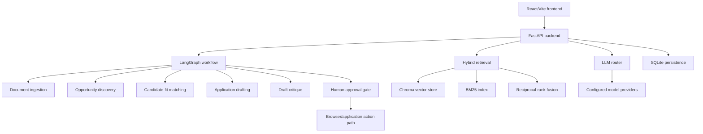

# ScholarOps AI

ScholarOps AI is a local-first assistant for PhD opportunity discovery, candidate-fit review, and draft application preparation. It combines a FastAPI backend, React/Vite frontend, LangGraph orchestration, document ingestion, hybrid retrieval, LLM routing, checkpointing, and a human-approval gate before application actions.

This repository is best read as an applied AI workflow system. It demonstrates how to connect retrieval, orchestration, drafting, review, and approval controls in a domain-specific assistant. It does not claim externally benchmarked ranking quality, zero hallucinations, live production usage, or autonomous submission of applications.

## What It Demonstrates

- Multi-step AI workflow orchestration with LangGraph.
- Document ingestion and retrieval over candidate/application evidence.
- Hybrid search using vector retrieval, BM25, and reciprocal-rank fusion.
- LLM provider routing across OpenAI-compatible providers and local models.
- Human-in-the-loop approval before browser/application actions.
- A React/Vite interface for opportunity review, application preparation, monitoring, and RAG inspection.
- Testable backend and frontend structure for an AI workflow product prototype.

## Evidence Map

| Claim | Repository evidence |
| --- | --- |
| LangGraph orchestration | `src/opportunity_intel/orchestrator/graph.py` builds a state graph with ingestion, discovery, matching, HITL, drafting, critique, browser-action, and checkpoint steps. |
| Hybrid retrieval | `src/opportunity_intel/rag/hybrid_search.py` combines Chroma vector search, BM25Okapi lexical retrieval, and reciprocal-rank fusion. |
| LLM provider routing | `src/opportunity_intel/llm/router.py` routes requests across configured providers and includes caching, token accounting, fallback handling, and observability hooks. |
| Human approval gate | The orchestration layer includes an explicit HITL step before browser/application actions. |
| Frontend workflow surface | `frontend/src/App.tsx` and `frontend/src/components/RagStudio.tsx` expose application workflow and retrieval-inspection views. |

See `docs/CLAIM_AUDIT.md` for the full claim review.

## Architecture



## Key Implementation Areas

### Workflow orchestration

The LangGraph workflow coordinates ingestion, discovery, match scoring, human review, drafting, critique, and optional browser action paths. SQLite checkpointing is used to persist workflow state locally.

### Retrieval and evidence handling

The retrieval layer includes document chunking, vector storage, lexical search, hybrid ranking, semantic caching, and knowledge-graph-oriented components. The README intentionally avoids claiming measured retrieval quality until an evaluation run is published.

### Application safety

ScholarOps is designed to keep application actions behind a human approval step. Recruiter-facing claims should describe this as a safety control, not as proof of fully autonomous production deployment.

### User interface

The frontend provides a local workflow surface for documents, advisor/opportunity views, preparation, application monitoring, and RAG inspection.

## Quick Start

### Prerequisites

- Python 3.12 or newer
- Node.js 20 or newer
- Provider API keys as needed for configured LLM/search integrations

### Backend

```bash
python3 -m venv .venv
source .venv/bin/activate
pip install -e .
python3 -m uvicorn opportunity_intel.api:app --host 127.0.0.1 --port 8000 --reload
```

### Frontend

```bash
cd frontend
npm install
npm run dev
```

Open the local frontend at the URL printed by Vite.

## Evaluation and Quality

This repository contains tests and evaluation-oriented components, but the public documentation should not claim quality scores, latency targets, portal coverage guarantees, or hallucination-free behavior without reproducible results.

Recommended evaluation work is documented in `docs/EVALUATION_PLAN.md` and includes:

- Retrieval relevance and source-grounding review.
- Candidate-fit ranking quality against labeled opportunities.
- Draft citation/evidence checks.
- HITL and application-action safety tests.
- Workflow resilience and provider fallback tests.

## Documentation

- `docs/CLAIM_AUDIT.md` documents which claims are supported, softened, or removed.
- `docs/EVALUATION_PLAN.md` defines a reproducible evaluation plan without inventing benchmark results.
- `docs/adr/0001-local-first-phd-application-workflow.md` records the main architecture decision and tradeoffs.

## License

This project is licensed under the MIT License. See `LICENSE` for details.
