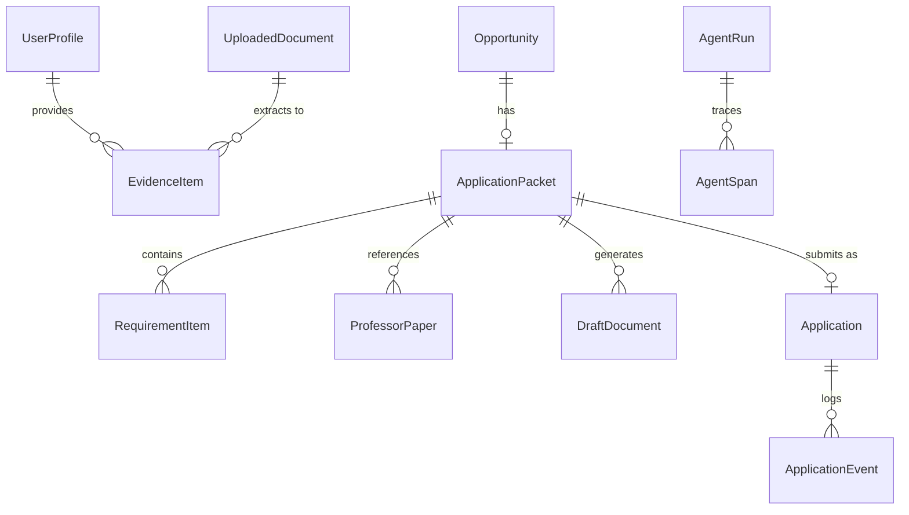

# ScholarOps AI (`opportunity_intel`) — System Design Document

**Document Version:** 1.0.0  
**Target Environment:** Local-First (macOS / Linux, Python 3.12+, Node 20+, SQLite / Postgres)  
**Security Boundary:** Loopback Only (`127.0.0.1`) with Single-Use HMAC Confirmation Tokens  

---

## 1. System Overview & Architecture

ScholarOps AI is a local-first, evidence-grounded multi-agent copilot engineered for doctoral applicants and academic researchers. It systematically discovers funded PhD positions and AI research vacancies worldwide, evaluates applicant-vacancy research fit, compiles tailored application dossiers (CVs, cover letters, research proposals, outreach emails), and executes assisted submissions ("Apply as me") under an uncompromising Human-in-the-Loop (HITL) cryptographic security gate.

```mermaid
graph TD
    subgraph Frontend ["Frontend Tier (React 18 + Vite)"]
        UI[Dashboard UI: Documents | Advisor | Opportunities | Prepare | Apply | Ops | Monitor]
    end

    subgraph API ["Backend API Tier (FastAPI @ 127.0.0.1:8000)"]
        Routes[API Router & Route Handlers]
        AuthGate[HMAC Token Verification Gate]
        LLM[Centralized LLMRouter]
    end

    subgraph CoreEngine ["Core Multi-Agent Engines"]
        Discovery[Discovery Engine: RSS + Web Search + Selectolax + Trafilatura]
        Prepare[Prepare & Matching: BGE-small Embeddings + PI Scholar Papers + RCTCEOV Drafter]
        Apply[Apply Engine: Pathfinding + Email/SMTP + Playwright Portal + Sandbox]
        Ops[Operations: Nightly Digest + Telemetry Spans + Telegram Dispatch]
    end

    subgraph Storage ["Persistence & Data Tier"]
        DB[(SQLite / PostgreSQL: opportunity_intel.db)]
        DocStore[Document Store: data/documents + data/import]
        LogStore[Telemetry Logs: data/logs/agent-runs.jsonl]
    end

    UI -->|HTTP / JSON @ 127.0.0.1| Routes
    Routes --> LLM
    Routes --> AuthGate
    Routes --> Discovery
    Routes --> Prepare
    Routes --> Apply
    Routes --> Ops
    Discovery --> DB
    Prepare --> DB
    Prepare --> DocStore
    Apply --> DB
    AuthGate --> DB
    Ops --> DB
    Ops --> LogStore
```

---

## 2. Comprehensive File Tree

```
PHD_Job_Research/
├── .env.example                     # Reference environment variables
├── .gitignore                       # Ignored build, DB, and credential files
├── AGENT_RULES.md                   # Operational constraints for AI pair programmers
├── Dockerfile                       # Container definition for local/remote deployment
├── docker-compose.yml               # Multi-service stack (db, redis, api, ollama, n8n)
├── pyproject.toml                   # Python dependencies and packaging specs
├── README.md                        # Project documentation and quickstart
├── config/
│   ├── discovery.yaml               # Feed URLs, extra search terms, domain filters
│   └── models.yaml                  # Model matrix & role bindings
├── data/
│   ├── .gitkeep
│   ├── apply_signing_secret         # Auto-generated HMAC secret (local file fallback)
│   ├── documents/                   # Uploaded master CVs, transcripts, proposals
│   ├── import/                      # Auto-scanned drop directory for raw files
│   ├── logs/
│   │   └── agent-runs.jsonl         # Detailed telemetry and span audit trail
│   └── opportunity.db               # SQLite database
├── docs/
│   ├── design.md                    # System architecture, API contracts, DB schema
│   ├── rag/                         # Advanced RAG subsystem (DesignGurus compliant)
│   │   ├── __init__.py              # RAG package public exports
│   │   ├── chunker.py               # Structure-aware markdown & semantic chunking
│   │   ├── hybrid_search.py         # BM25 + ChromaDB dense hybrid search with RRF
│   │   ├── knowledge_graph.py       # NetworkX academic property graph & multi-hop traversal
│   │   ├── query_enhancer.py        # Multi-query expansion & HyDE generator
│   │   ├── reranker.py              # LLM Cross-Encoder candidate reranker
│   │   ├── semantic_cache.py        # Cosine similarity semantic cache (<50ms hit)
│   │   ├── self_improving_rag.py    # Corrective RAG (CRAG) with LLM-as-a-Judge feedback
│   │   └── vector_store.py          # Persistent ChromaDB vector store
│   ├── orchestrator/                # Multi-agent orchestrators
│   │   ├── graph.py                 # Core LangGraph pipeline state graph
│   │   ├── google_workflow.py       # Google GenAI Search + LangGraph orchestrator
│   │   └── nodes.py                 # Pipeline execution nodes
│   ├── domain/                      # Domain entities & database modelster plan
│   ├── tasks.md                     # Implementation task checklist
│   ├── LLM_ROUTING.md               # Token economics and provider routing
│   └── PLAN.md                      # Long-term product master plan
├── frontend/
│   ├── index.html                   # Single-page HTML entry point
│   ├── package.json                 # Node dependencies (React 18, Vite, Lucide icons)
│   ├── tsconfig.json                # TypeScript compiler configuration
│   ├── vite.config.ts               # Vite bundler configuration (127.0.0.1 binding)
│   └── src/
│       ├── App.tsx                  # Main tabbed application (7 views)
│       ├── index.css                # Global stylesheet & design tokens
│       └── main.tsx                 # React DOM mount point
├── n8n/
│   └── nightly-discovery.json       # Optional n8n workflow for scheduled execution
├── scripts/
│   ├── dev-api.sh                   # Local development server launcher
│   └── run-nightly.sh               # CLI cron runner for nightly discovery cycle
├── src/
│   └── opportunity_intel/
│       ├── __init__.py
│       ├── config.py                # Pydantic Settings and environment validation
│       ├── db.py                    # SQLAlchemy session manager & engine factory
│       ├── main.py                  # CLI and module entry point
│       ├── agents/
│       │   ├── __init__.py
│       │   └── advisor.py           # Document-to-profile builder & advisor chat
│       ├── api/
│       │   ├── __init__.py
│       │   ├── app.py               # FastAPI application factory & middleware
│       │   ├── deps.py              # Database session dependency injection
│       │   ├── routes.py            # RESTful API route definitions
│       │   └── schemas.py           # Pydantic request and response contracts
│       ├── apply/
│       │   ├── __init__.py
│       │   ├── adapters.py          # Manual, Sandbox, and HTTP form adapters
│       │   ├── email_send.py        # SMTP email adapter with attachments
│       │   ├── mapping.py           # Form-field deterministic mapping & checksums
│       │   ├── pathfind.py          # Portal vs Email heuristic & LLM classifier
│       │   ├── portal.py            # Playwright portal automation with HITL pauses
│       │   ├── secrets.py           # HMAC secret resolution
│       │   ├── service.py           # Apply preview, approval, and submission
│       │   └── tokens.py            # HMAC token issuing, hashing, and parsing
│       ├── discovery/
│       │   ├── __init__.py
│       │   ├── enrich.py            # Country and supervisor heuristic enrichment
│       │   ├── extract.py           # Selectolax & Trafilatura text extraction
│       │   ├── fetch.py             # HTTP client with rate-limiting & spoofed UA
│       │   ├── pipeline.py          # Multi-source orchestration pipeline
│       │   ├── quality.py           # PhD qualification & deduplication checks
│       │   ├── service.py           # Discovery execution and persistence
│       │   ├── sources.py           # RSS (EURAXESS, AcademicTransfer) & FindAPhD
│       │   └── web_search.py        # DuckDuckGo, Brave, Tavily, Gemini search
│       ├── documents/
│       │   ├── __init__.py
│       │   ├── extract.py           # PDF, DOCX, Markdown, Text parser
│       │   ├── import_folder.py     # Batch folder synchronization engine
│       │   └── storage.py           # File hashing and local disk storage
│       ├── domain/
│       │   ├── __init__.py
│       │   └── models.py            # SQLAlchemy 2.0 ORM domain entities
│       ├── execution/
│       │   ├── __init__.py
│       │   └── latex.py             # pdflatex compiler and Jinja2 templater
│       ├── llm/
│       │   ├── __init__.py
│       │   ├── budget.py            # Daily spend tracker and budget enforcement
│       │   ├── gemini.py            # Raw REST Gemini search grounding
│       │   ├── models_config.py     # YAML configuration parser
│       │   ├── prompting.py         # R-C-T-C-E-O-V prompts
│       │   └── router.py            # Multi-provider LLM router & JSON repair
│       ├── memory/
│       │   ├── __init__.py
│       │   └── checkpoint.py        # Thread state serialization
│       ├── observability/
│       │   ├── __init__.py
│       │   └── trace.py             # Agent run & span context manager
│       ├── ops/
│       │   ├── __init__.py
│       │   ├── digest.py            # Digest message formatting & deadline calculation
│       │   ├── nightly.py           # Scheduled cycle runner
│       │   ├── nightly_cli.py       # CLI wrapper for cron execution
│       │   ├── notify.py            # Telegram and log dispatcher
│       │   ├── tools.py             # Allowlisted ops tools
│       │   └── tracker.py           # Aggregated statistics and metric builder
│       ├── orchestrator/
│       │   ├── __init__.py
│       │   ├── graph.py             # LangGraph DAG definition & HITL interruption
│       │   └── nodes.py             # Pipeline node implementations
│       ├── prepare/
│       │   ├── __init__.py
│       │   ├── papers.py            # Semantic Scholar & OpenAlex API client
│       │   └── service.py           # Requirements scoring & evidence-bound drafting
│       ├── rag/
│       │   ├── __init__.py
│       │   └── faiss_store.py       # FAISS vector store integration
│       ├── retrieval/
│       │   ├── __init__.py
│       │   └── chroma_store.py      # Vector retrieval layer
│       └── scoring/
│           ├── __init__.py
│           └── rules.py             # Deterministic qualification rule engine
└── tests/
    ├── conftest.py                  # Pytest fixtures and mock client setup
    ├── helpers.py                   # Test data generators and mock models
    └── test_*.py                    # Complete test suite (162 test cases)
```

---

## 3. Database Schema (SQLite / SQLAlchemy ORM)

All domain entities inherit from SQLAlchemy's `DeclarativeBase` with strict types and relationship cascades.



### Table Specifications

#### 1. `user_profiles`
*   `id` (INTEGER, PK)
*   `full_name` (VARCHAR(200))
*   `email` (VARCHAR(200))
*   `highest_degree` (VARCHAR(200))
*   `research_interests` (TEXT)
*   `skills` (TEXT)
*   `funding_requirement` (VARCHAR(100), default: `"fully_funded"`)
*   `target_countries` (VARCHAR(200))
*   `notes` (TEXT)
*   `profile_summary` (TEXT)
*   `profile_source` (VARCHAR(40), default: `"manual"`)
*   `updated_at` (DATETIME, default: `now()`)

#### 2. `uploaded_documents`
*   `id` (INTEGER, PK)
*   `original_name` (VARCHAR(500))
*   `stored_name` (VARCHAR(500), UNIQUE)
*   `doc_type` (VARCHAR(80)) — `academic_cv`, `research_cv`, `research_proposal`, `publication`, `transcript`, `cover_letter`, `other`
*   `mime_type` (VARCHAR(120))
*   `file_size` (INTEGER)
*   `extracted_text` (TEXT)
*   `parsed_facts` (TEXT)
*   `status` (VARCHAR(40)) — `uploaded`, `parsed`, `failed`
*   `source_path` (VARCHAR(1000), INDEX)
*   `content_hash` (VARCHAR(64))
*   `created_at` (DATETIME, default: `now()`)

#### 3. `evidence_items`
*   `id` (INTEGER, PK) — Referenced as `EV-<id>` in tailored documents
*   `document_id` (INTEGER, FK `uploaded_documents.id`, nullable)
*   `category` (VARCHAR(80)) — `education`, `publication`, `project`, `skill`, `grant`, `work`
*   `content` (TEXT)
*   `source_quote` (TEXT)
*   `created_at` (DATETIME, default: `now()`)

#### 4. `opportunities`
*   `id` (INTEGER, PK)
*   `kind` (VARCHAR(20), default: `"phd"`)
*   `source` (VARCHAR(50)) — `euraxess`, `academictransfer`, `findaphd`, `duckduckgo`, `brave`, etc.
*   `title` (VARCHAR(500))
*   `organization` (VARCHAR(300))
*   `country_code` (VARCHAR(8))
*   `location` (VARCHAR(300))
*   `source_url` (VARCHAR(1000), UNIQUE)
*   `funding` (VARCHAR(200))
*   `deadline` (DATE, nullable)
*   `summary` (TEXT)
*   `supervisor` (VARCHAR(300))
*   `rule_fit` (FLOAT, default: 0.0)
*   `llm_fit` (FLOAT, nullable)
*   `fit_rationale` (TEXT)
*   `status` (VARCHAR(40)) — `discovered`, `shortlisted`, `prepared`, `submitted`, `rejected`
*   `shortlisted` (INTEGER, default: 0)
*   `apply_channel` (VARCHAR(40)) — `email`, `portal`
*   `apply_url` (VARCHAR(1000))
*   `apply_email` (VARCHAR(300))
*   `apply_notes` (TEXT)
*   `created_at` (DATETIME, default: `now()`)

#### 5. `application_packets`
*   `id` (INTEGER, PK)
*   `opportunity_id` (INTEGER, FK `opportunities.id`, UNIQUE)
*   `status` (VARCHAR(40)) — `preparing`, `ready`, `failed`
*   `error` (TEXT)
*   `created_at` (DATETIME, default: `now()`)
*   `updated_at` (DATETIME, default: `now()`)

#### 6. `requirement_items`
*   `id` (INTEGER, PK)
*   `packet_id` (INTEGER, FK `application_packets.id`, INDEX)
*   `text` (TEXT)
*   `status` (VARCHAR(20)) — `met`, `gap`, `unknown`
*   `evidence_note` (TEXT)

#### 7. `professor_papers`
*   `id` (INTEGER, PK)
*   `packet_id` (INTEGER, FK `application_packets.id`, INDEX)
*   `title` (VARCHAR(800))
*   `year` (INTEGER, nullable)
*   `authors` (VARCHAR(500))
*   `venue` (VARCHAR(400))
*   `url` (VARCHAR(1000))

#### 8. `draft_documents`
*   `id` (INTEGER, PK)
*   `packet_id` (INTEGER, FK `application_packets.id`, INDEX)
*   `kind` (VARCHAR(40)) — `cv_tailor`, `cover_letter`, `research_proposal`, `outreach_email`
*   `body` (TEXT)
*   `cited_evidence_ids` (TEXT, JSON array of integers `[1, 4, 8]`)
*   `cited_paper_titles` (TEXT, JSON array of strings)

#### 9. `applications`
*   `id` (INTEGER, PK)
*   `packet_id` (INTEGER, FK `application_packets.id`, UNIQUE)
*   `adapter` (VARCHAR(40)) — `manual`, `sandbox`, `email`, `portal`
*   `status` (VARCHAR(40)) — `previewed`, `pending_approval`, `submitted`, `failed`, `rejected`
*   `payload_json` (TEXT)
*   `payload_sha256` (VARCHAR(64))
*   `token_hash` (VARCHAR(64))
*   `token_expires_at` (DATETIME, nullable)
*   `token_used` (INTEGER, default: 0)
*   `receipt` (VARCHAR(500))
*   `error` (TEXT)
*   `created_at` (DATETIME, default: `now()`)
*   `submitted_at` (DATETIME, nullable)

#### 10. `application_events`
*   `id` (INTEGER, PK)
*   `application_id` (INTEGER, FK `applications.id`, INDEX)
*   `action` (VARCHAR(80))
*   `detail` (TEXT)
*   `created_at` (DATETIME, default: `now()`)

#### 11. `agent_runs` & `agent_spans`
*   `agent_runs.id` (VARCHAR(36), PK)
*   `agent_runs.agent` (VARCHAR(80), INDEX)
*   `agent_runs.action` (VARCHAR(80))
*   `agent_runs.status` (VARCHAR(20))
*   `agent_runs.input_summary` (TEXT)
*   `agent_runs.output_summary` (TEXT)
*   `agent_runs.error` (TEXT)
*   `agent_runs.duration_ms` (INTEGER)
*   `agent_spans.run_id` (VARCHAR(36), FK `agent_runs.id`)
*   `agent_spans.name` (VARCHAR(120))
*   `agent_spans.duration_ms` (INTEGER)

#### 12. `nightly_digests` & `notifications`
*   `nightly_digests`: stores periodic discovery runs, new counts, high fit counts, upcoming deadlines, and dispatched message text.
*   `notifications`: records dispatch channel (`telegram`, `log`), delivery status, and error logs.

---

## 4. RESTful API Contracts

All endpoints are hosted at `http://127.0.0.1:8000`.

### Summary of Routes

| Method | Path | Request Body | Response Body | Description |
| :--- | :--- | :--- | :--- | :--- |
| `GET` | `/health` | — | `{"status": "ok"}` | Service health check |
| `GET` | `/api/llm/status` | — | `LlmStatusOut` | Configured keys, models, and country rules |
| `GET` | `/api/profile` | — | `ProfileOut \| null` | Retrieve stored master user profile |
| `GET` | `/api/documents` | — | `list[DocumentOut]` | List all uploaded/imported documents |
| `GET` | `/api/documents/import-folder/info` | — | `FolderImportInfoOut` | Scan `data/import` directory status |
| `POST` | `/api/documents/import-folder` | — | `FolderImportResultOut` | Trigger batch import from `data/import` |
| `POST` | `/api/documents/upload` | Multipart: `file`, `doc_type` | `DocumentOut` | Upload single document (max 15MB) |
| `DELETE`| `/api/documents/{id}` | — | `{"status": "deleted"}` | Delete document and stored file |
| `POST` | `/api/profile/analyze` | — | `AnalyzeResultOut` | Extract facts, build profile, synthesize suggestions |
| `GET` | `/api/advisor/suggestions` | — | `list[ResearchSuggestionOut]`| Active strategic research suggestions |
| `GET` | `/api/advisor/messages` | — | `list[AdvisorMessageOut]` | Advisor chat conversation history |
| `POST` | `/api/advisor/chat` | `ChatRequest` | `ChatResponse` | Ask academic advisor questions |
| `GET` | `/api/opportunities` | — | `list[OpportunityOut]` | Ranked opportunity listing (max 200) |
| `POST` | `/api/opportunities/{id}/shortlist` | `ShortlistRequest` | `OpportunityOut` | Toggle shortlist status |
| `GET` | `/api/evidence` | — | `list[EvidenceOut]` | Atomic verified evidence items (`EV-<id>`) |
| `POST` | `/api/opportunities/{id}/prepare` | — | `PacketOut` | Generate requirements, PI papers, drafts |
| `GET` | `/api/packets` | — | `list[PacketOut]` | List generated application packets |
| `GET` | `/api/packets/{id}` | — | `PacketOut` | Get detailed packet with drafts |
| `GET` | `/api/packets/{id}/apply/preview`| — | `ApplyPreviewOut` | Validate payload & recommend adapter |
| `POST` | `/api/packets/{id}/apply/request-approval` | `ApprovalRequest` | `ApprovalIssuedOut` | Issue expiring single-use HMAC token |
| `GET` | `/api/applications` | — | `list[ApplicationOut]` | List applications and submission audit trails |
| `GET` | `/api/applications/{id}` | — | `ApplicationOut` | Get application details and event history |
| `POST` | `/api/applications/{id}/approve`| `ApproveRequest` | `ApplicationOut` | Verify HMAC token and execute dispatch |
| `POST` | `/api/applications/{id}/reject` | `RejectRequest` | `ApplicationOut` | Reject and revoke pending application |
| `POST` | `/api/discovery/runs` | `DiscoveryRequest` | `DiscoveryRunOut` | Trigger on-demand vacancy discovery |
| `GET` | `/api/monitor/health` | — | `MonitorHealthOut` | Failure counts, log paths, last errors |
| `GET` | `/api/monitor/runs` | — | `list[AgentRunOut]` | Telemetry runs with nested execution spans |
| `POST` | `/api/ops/nightly` | `NightlyRequest` (Header: `x-ops-secret`) | `NightlyDigestOut` | Execute nightly discovery and notifications |
| `GET` | `/api/ops/digest` | — | `NightlyDigestOut \| null` | Fetch latest nightly digest summary |
| `GET` | `/api/ops/tracker` | — | `dict` | Aggregated dashboard operational metrics |
| `GET` | `/api/notifications` | — | `list[NotificationOut]` | Dispatched alert history |
| `GET` | `/api/ops/tools` | — | `OpsToolsListOut` | List allowlisted operational tools |
| `POST` | `/api/ops/tools` | `OpsToolRequest` | `OpsToolOut` | Execute safe allowlisted tool |
| `POST` | `/api/ops/pipeline` | `PipelineRequest` | `PipelineOut` | LangGraph state-machine runner / resume |

---

## 5. Centralized LLM Routing & Prompt Protocol

Agents must never instantiate vendor SDKs directly. All requests go through `LLMRouter.complete(role, messages, json_mode=...)`.

### Locked Model Matrix

```
┌──────────────┬──────────────┬──────────────────────────┬────────────────────────────────────────────────────────┐
│ Role         │ Provider     │ Model ID                 │ Settings / Operational Policy                          │
├──────────────┼──────────────┼──────────────────────────┼────────────────────────────────────────────────────────┤
│ extract      │ Groq         │ openai/gpt-oss-20b       │ High throughput JSON extraction (Llama 3.x deprecated) │
│ reason       │ DeepSeek     │ deepseek-v4-flash        │ thinking: disabled (Cost-efficient evaluation & rules) │
│ draft        │ DeepSeek     │ deepseek-v4-flash        │ thinking: enabled, reasoning_effort: high              │
│ polish       │ Groq         │ qwen/qwen3.6-27b         │ Opt-in via GROQ_POLISH_ENABLED=true                    │
│ embed        │ Hugging Face │ BAAI/bge-small-en-v1.5   │ Local / embedding endpoint vector matching             │
│ fallback     │ Ollama       │ qwen2.5:7b               │ Offline execution (docker compose --profile local-llm) │
│ search_grnd  │ Gemini       │ gemini-2.5-flash         │ REST API grounding (no vendor SDK import)              │
│ openai_fb    │ OpenAI       │ gpt-5-nano-2025-08-07    │ Automatic fallback if DeepSeek key missing             │
└──────────────┴──────────────┴──────────────────────────┴────────────────────────────────────────────────────────┘
```

### R-C-T-C-E-O-V Prompt Specification

Every agent interaction strictly enforces the **R-C-T-C-E-O-V** contract:
1. **Role (R):** Explicit persona with boundaries (e.g., "You are an evidence-grounded academic CV tailor").
2. **Context (C):** Verified source data (profile, atomic evidence items, PI publications).
3. **Task (T):** Precise instruction (e.g., "Draft a 4-paragraph Statement of Purpose").
4. **Constraints (C):** Negative boundaries ("Never invent papers, metrics, or credentials. Only cite provided EV-IDs").
5. **Examples (E):** In-context few-shot input/output format.
6. **Output (O):** Strict JSON response format with typed fields.
7. **Verification (V):** Programmatic post-processing: ungrounded claims are filtered before database persistence.

---

## 6. Security, Localhost Binding & HITL Dispatch

1. **Loopback Isolation:**
   * FastAPI: `uvicorn opportunity_intel.main:app --host 127.0.0.1 --port 8000`
   * Vite Frontend: `server: { host: "127.0.0.1", port: 5173 }`
2. **Cryptographic Human Approval Gate:**
   * Token Generation: `token = hmac_sha256(secret, f"{app_id}:{payload_sha256}:{expires_at}")`
   * Single-Use Lifetime: Token TTL defaults to 300 seconds. Upon use or failure, `token_used = 1` and `token_hash = ""` in the database to prevent replay attacks.
   * Payload Verification: The submitted payload's SHA-256 hash must match the exact hash locked at preview time.
3. **Dispatch Adapters:**
   * `sandbox`: Mock dispatcher for development and integration tests.
   * `manual`: Formats copy-paste snippets and instructions for manual submission.
   * `email`: Sends via SMTP with applicant's sender credentials and attached CV/proposal PDFs only when `APPLY_AS_ME=true`.
   * `portal`: Playwright script fills public forms and pauses before submission.

---
